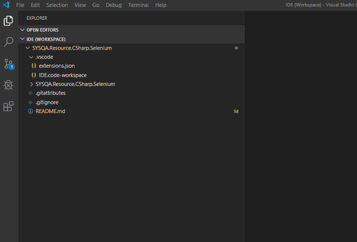
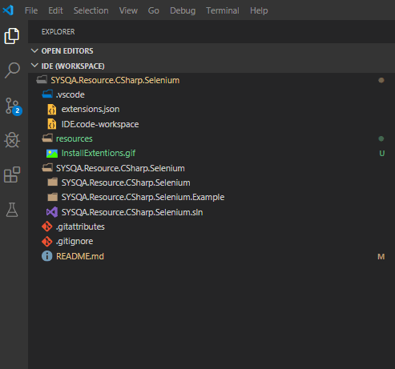

# SYSQA.Resource.CSharp.Selenium

## Doel

## Voorbereiding
De volgende stappen moet je nemen voor dat je aan dit project kunt beginnen.
* Intalleer de benodigde software
    * [Download en installeer Visual Studio Code (VSCode)](https://code.visualstudio.com/)
    * [Download en installeer de aanbevolen versie van dotnet framework](https://dotnet.microsoft.com/download/dotnet-framework/net47)
* Clone de gitrepository of [download de zip hier](https://github.com/SYSQA-ExpertiseLeadership/SYSQA.Resource.CSharp.Selenium/archive/master.zip)
* Ga naar de `.vscode` folder en open de `IDE.code-workspace` file met vs code.

* Ga naar de test window en druk op `Reload Test` om te kijken of de voorbeeld test succesvol gevonden wordt.

## Tips

* Als een verandering niet gelijk doorgevoerd lijkt te worden probeer dan VSCode een keer te refreshen. De toetsencombinatie `Ctrl+R` is een snelle optie.

## Bijdragen aan deze resource
